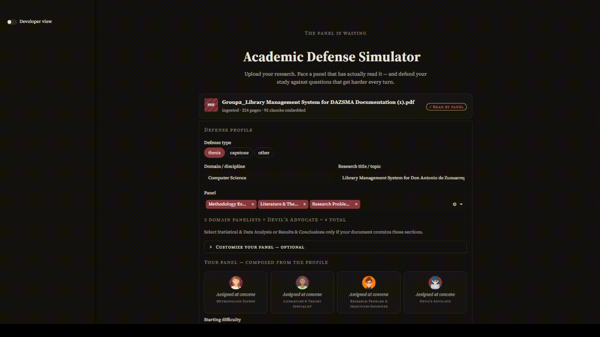
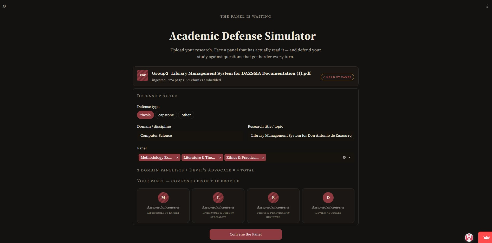

# Academic Defense Simulator

**Most RAG demos retrieve documents to answer your questions. This one reads
your research paper and uses it to interrogate you.**

Upload a thesis, capstone, or research document and face a live, adaptive
cross-examination from a panel of AI examiners — each grounded in a specific
passage of your actual document, each holding a distinct role, and each quietly
adjusting difficulty based on how well you're holding up.

**[Try the live demo →](https://academic-defense-simulator.streamlit.app/)**

> Demo mode runs on a shared key with a small daily session cap. Paste your own
> Gemini API key in the sidebar to bypass it — the key is held in session memory
> only, never written to disk and never logged (verified with a sentinel-key
> trace, not just by inspection). First load takes ~30s; see
> [Known limitations](#known-limitations).



**[Read the case study →](docs/case-study.md)** — the evals, the findings, and
the one that a later eval walked back.

---

## Why this is interesting

- **RAG inverted.** Retrieval feeds *question generation*, not answering. Every
  question a panelist asks is grounded in a passage retrieved from your
  document, and the grounding is programmatically checked on every turn rather
  than trusted.
- **Adaptive difficulty you can't see.** Every answer is scored internally —
  clarity, depth, grounding — via structured output, and those scores steer the
  next question's difficulty without ever surfacing mid-session. The thermostat
  is hidden because a defense you can read isn't practice.
- **A panel, not a chatbot.** Nine examiner archetypes hold character across a
  full session, with turn-taking, follow-up chains when a panelist smells
  weakness, and a Devil's Advocate who cross-references earlier answers to
  contest your strongest claim.
- **Eval-driven, and the evals changed the design.** Model choice, prompt
  wording, and orchestration were measured against real output, not assumed —
  including one case where a second-document eval contradicted a headline
  finding of mine and I published the contradiction. See the
  [case study](docs/case-study.md).

## The panel

You compose the panel; a Devil's Advocate is always seated.

| Archetype | Lane |
|---|---|
| Methodology Expert | Research design, sampling, instrumentation |
| Literature & Theory Specialist | Framing, citation, theoretical grounding |
| Technical Implementation Reviewer | Architecture, tooling, build decisions |
| Ethics & Practicality Reviewer | Consent, risk, real-world deployability |
| Research Problem & Objectives Reviewer | Problem statement, scope, objective alignment |
| Statistical & Data Analysis Reviewer | Analysis choices, inference, data handling |
| Results & Conclusions Reviewer | Whether the conclusions follow from the results |
| Industry & Professional Practice Reviewer | Standards, practice, professional relevance |
| Devil's Advocate | Contests your strongest claim, using your earlier answers |

## How it works

```
PDF ──► chunk (PyMuPDF, paragraph-aware) ──► relevance gate ──► embed locally
                                                                (MiniLM)
        ┌───────────────────────────────────────────────────────────┘
        ▼
  Defense profile (type, domain, selected archetypes) ──► persona generation
        ▼
  ┌─ Agent loop ─────────────────────────────────────────────────┐
  │ retrieve chunk ► panelist asks grounded question ► you answer │
  │ ► internal scoring ► difficulty adjusts ► follow-up or next   │
  │   panelist (weakness = they keep the floor)                   │
  └───────────────────────────────────────────────────────────────┘
        ▼
  Scoring report — narrative, difficulty trajectory, per-panelist averages,
  pressure moments (did you recover, hold, or deteriorate?), and per-answer
  suggestions grounded in the same passages the questions came from
        ▼
  Persisted to disk ──► cross-session analytics (recurring gap themes)
```



Key implementation choices, and why:

- **Structured state, not chat-history replay.** Each LLM call renders a fresh
  prompt from a typed session model instead of replaying a growing transcript.
  Persona framing is re-injected every call and can't dilute over distance —
  and as a free consequence, crash-resume is loading state rather than
  reconstructing a conversation, because no context ever lived only in memory.
- **Grounding is checked, not hoped for.** Every generated question carries a
  reference that's matched against the retrieved chunk (exact, then fuzzy). At
  high difficulty, failures trigger a retry-then-flag path; flagged turns stay
  visible in the exported transcript. This check has a known false-negative
  mode, documented below rather than buried.
- **Local embeddings, brute-force retrieval.** sentence-transformers plus numpy
  cosine similarity. At a few dozen vectors per document a vector database is
  complexity without payoff — a deliberate scale decision, recorded, with the
  upgrade path known.
- **Provider-isolated LLM layer.** All Gemini-specific code sits behind one
  interface, and every call passes through a single choke point that logs
  lifecycle, counts calls, and enforces a sliding-window rate limit. That choke
  point is how a real orchestration bug was caught.
- **Suggestions are post-mortem, by design.** Per-answer coaching is generated
  once, at session end, from the full transcript — never during the session.
  Scores and advice both stay out of the room while you're still in it.

## Engineering process

The decision record in [`docs/`](docs/) is the part I'd point at first. Retired
decisions stay in it alongside current ones, with provenance recorded and
deviations logged — including a rule I pre-committed to that turned out to be
wrong, and a workflow violation I accused myself of that turned out never to
have happened and was struck once `git reflog` disproved it.

- **A founding assumption, retired by evidence — then partly walked back by more
  evidence.** I designed the internal scoring signal as a correctness detector;
  a probe showed it was measuring something else. A later eval on a document the
  system had never seen failed to reproduce the key contrast. Both halves are in
  the [case study](docs/case-study.md), in that order.
- **Model fitness tested per task, not assumed from price.** The cheap dev
  default (`gemini-3.1-flash-lite`) was diagnosed unfit for judgment work, with
  probe results committed as permanent artifacts. Judgment paths that fit the
  free-tier budget run on `gemini-2.5-flash`; the one that doesn't is named in
  [Known limitations](#known-limitations) rather than quietly left out.
- **Predicted, then measured.** Per-session LLM call count was derived from the
  design docs as a formula before instrumentation existed, then verified live by
  a counter at the provider boundary. The first instrumented run measured a
  session ending two turns early — the counter exposed an orchestration bug
  where one panelist's spent follow-up budget silently blocked another's,
  characterized with line-level evidence before any fix was written.
- **Measured, never derived by arithmetic.** The rate limiter's ceiling doesn't
  behave as a literal cap — observed peak runs one request above the configured
  value. The shipped setting is the one empirically verified clean against the
  real tier. Any tier change re-verifies from scratch.
- **No LLM grading an LLM.** Every probe's quality columns are judged by hand.
  The difficulty-tone probe emits a shuffled judging file with labels stripped
  and a separate key, so the judgment is blind and the unblinding is mechanical.

## Known limitations

Stated here so they're read rather than discovered.

**Retrieval isn't independently evaluated.** The central claim of the project is
RAG-for-question-generation. The generation half is evaluated hard; the retrieval
half never has been, and that's the largest gap here. One defect is already
documented: the retrieval query for each archetype is a fixed string, so the
embedding is fixed, so the ranking is identical across every session for a given
document. It surfaces as repeated questions across runs and occasional
front-matter hits. Three checks that need no labeled data are specified in
`docs/` and not yet run.

**The internal scoring signal did not reproduce across documents.** On the
development document, a fluent non-committal answer and a genuine non-answer
drew opposite difficulty responses — the contrast the whole interpretation rests
on. On a held-out document, both eased. The mechanism runs; its reliability on
the production model is unestablished. Full detail in the
[case study](docs/case-study.md).

**Adaptive difficulty is implemented, not calibration-verified.** No figure is
claimed for it anywhere in this repo, and the one probe column that looks like
evidence is explicitly declined as such in the case study.

**Per-answer scoring still runs on the model diagnosed unfit for judgment.**
`gemini-2.5-flash` can't sustain two calls per turn on a free tier, so scoring
stays on the cheap model as a deliberate, documented tradeoff. `gemini-2.5-flash`
is used where the budget allows: the relevance gate, answer suggestions, and gap
clustering — two calls per session, capping the app at roughly ten full sessions
a day. This is the single biggest thing a paid tier would change.

**The grounding check has a systematic false-negative mode.** It matches a
contiguous span, so a reference that legitimately assembles non-contiguous text
— two figure captions, a range across rows, two cells of one table row — fails
while being entirely accurate. It concentrates in the archetypes that must cite
two things through a schema with one slot, which means the metric penalises the
more sophisticated question types.

**Analytics is local-only by design.** Sessions persist to disk on whichever
machine runs the app, so the public demo shows an empty analytics view. That's
the intended privacy behaviour, not a broken feature.

**Panelist voice runs on Xiaomi's Mimo API, with a browser fallback.** Every
question is spoken aloud by default, through nine distinct designed voices (one
per archetype, via Mimo's voice-design model, not a fixed preset) when
`MIMO_API_KEY` is configured — which it is on the live demo. Any synthesis
failure — auth, quota, timeout, or the API's free-tier promo lapsing — falls
back silently to the browser's own speech engine for that turn only, never
breaking the session. On the fallback path, which voices exist is the
browser's business, not the app's: Edge ships several neural and accented
English voices that Chrome doesn't have, so the same session sounds noticeably
better there.

**Live demo operational caveats.** The app sleeps after 12 hours without traffic,
so a first visitor gets a wake-up click plus roughly 30 seconds. The embedding
weights are fetched from HuggingFace at cold start — a real runtime dependency,
not just latency. Working memory sits under Streamlit Community Cloud's
documented maximum but above its guaranteed floor: it runs fine, and it isn't
guaranteed to.

## Stack

Python · Gemini API (`google-genai`) · Xiaomi Mimo TTS · sentence-transformers
(`all-MiniLM-L6-v2`, local) · numpy retrieval · PyMuPDF · Pydantic · Streamlit ·
pytest

321 tests, 320 passing. The one failure reads a real local session fixture
that lives outside the repo (gitignored), so it's absent on a fresh clone —
logged in `ROADMAP.md` rather than skipped to keep the suite honestly green.

Business logic is Streamlit-free by rule, verified by grep rather than assumed —
no module outside the UI layer imports it. The UI is a thin shell over typed
models, which is the migration seam for a future FastAPI + React frontend.

## Run it locally

```bash
git clone https://github.com/slvr123/Academic-Defense-Simulator.git
cd Academic-Defense-Simulator
pip install -r requirements.txt
# .env — see .env.example; requires a Gemini API key
streamlit run academic_defense_simulator/streamlit_app.py
```

## Roadmap

**Shipped:** multi-panelist orchestration · adaptive difficulty · Devil's
Advocate · scoring report with grounded per-answer suggestions · document
relevance gate · session persistence and resume · cross-session analytics ·
bring-your-own-key with a capped demo mode · nine archetypes · deployment
hardening · AI voice narration (Xiaomi Mimo, nine designed voices, browser
fallback)

**Next:** a retrieval eval, closing the gap named above · a difficulty
discrimination probe · widening `grounding_reference` to fix the false-negative
mode at the schema rather than at the check

---

Built by **Sean Silver Allata** — [GitHub](https://github.com/slvr123) ·
[LinkedIn](https://www.linkedin.com/in/sean-silver-allata-9b1885395/)
BS Computer Science, Technological Institute of the Philippines.
